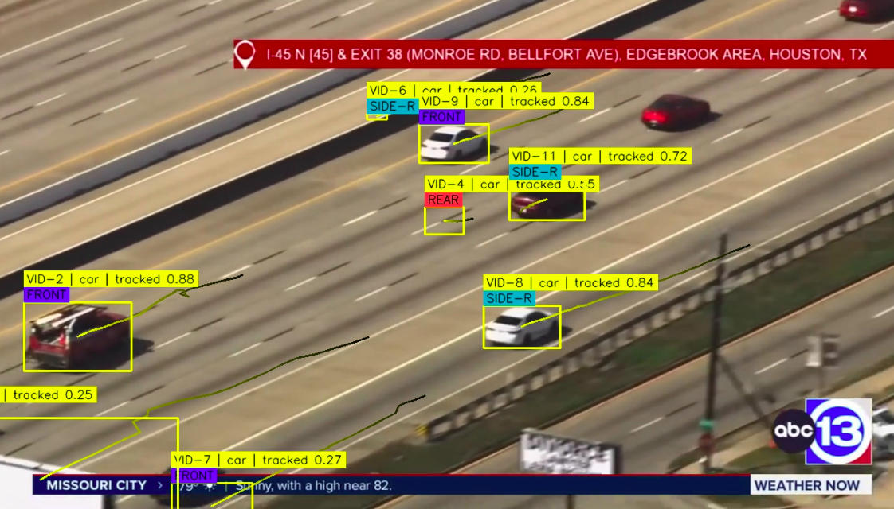
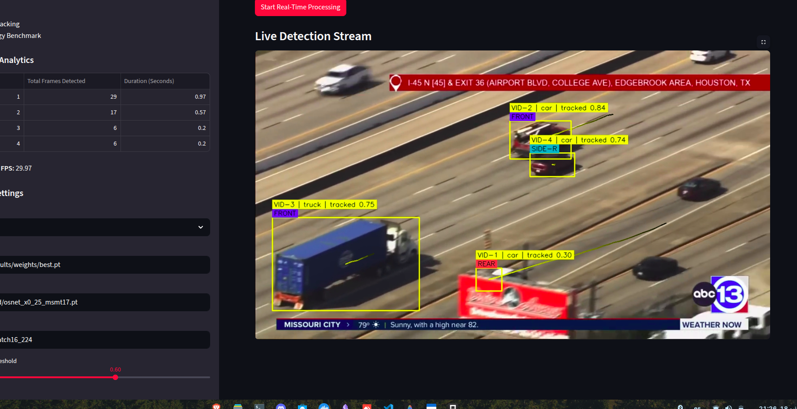

# Rapport d'état d'avancement sur le projet de détection et identification des véhicules

**Fait par :** Youssef Mahdi  
**Encadré par :** Rime Bouali, Zakaria ABOUHANIFA

---

## 1. Contexte et objectif

Le suivi de véhicules dans les flux de vidéosurveillance est confronté à deux classes de défauts structurels lorsque les cibles traversent des zones d'occlusion ou changent d'angle de caméra :

| Défaut | Description | Impact |
|--------|-------------|--------|
| **Fragmentation d'identité** | Un même véhicule reçoit plusieurs identifiants distincts après réapparition | Perte de continuité de trajectoire, comptage faux |
| **Collision d'identité** | Plusieurs véhicules différents reçoivent le même identifiant | Profilage temporel mélangé, alertes erronées |

L'objectif du pipeline est d'assigner un identifiant global unique et persistant à chaque véhicule,
robuste aux occlusions (tunnels, angles morts) et aux changements de point de vue entre caméras.

---

## 2. Architecture globale du pipeline (v5.0)

Le pipeline de traitement a été conçu selon une architecture modulaire en sept étapes séquentielles (récemment mise à jour vers la version 5.0). Cette structure en cascade permet d'optimiser les calculs en reportant les opérations les plus lourdes (l'extraction par apprentissage profond) uniquement sur les cibles géométriquement viables, tout en intégrant des mécanismes d'état de l'art (SOTA).

```text
Trame brute
    │
    ▼
[1] Détection des véhicules (filtrage spatial)
    │
    ▼
[2] Classification du point de vue (face / arrière / profil / plongeant)
    │
    ▼
[3] Extraction de signatures d'apparence :
     ├─ Empreinte visuelle globale
     ├─ Empreintes visuelles découpées (6 zones horizontales)
     └─ Attributs sémantiques (couleur, classe, plaque OCR, accessoires)
    │
    ▼
[4] Indexation dans la Galerie Multi-Vues (mémoire à long terme)
    │
    ▼
[5] Modélisation cinétique des trajectoires (mémoire à court terme)
    │
    ▼
[6] Moteur d'assignation contextuelle (Cascade Matcher + Filtre Spatio-Temporel)
    │
    ▼
[7] Post-traitement (k-Reciprocal Re-Ranking)
    │
    ▼
[8] Sortie : Annotations visuelles temps réel et journaux de données
```

---

## 3. Méthodes et Modèles Utilisés

Pour chaque étape du pipeline, nous avons sélectionné et intégré des méthodes de pointe (SOTA) :

### 3.1 Détection Spatiale : YOLOv11m
La localisation des véhicules est effectuée par le modèle convolutif **YOLOv11m** (Ultralytics). Ce modèle intègre un mécanisme d'attention spatiale globale capturant les relations pixel-à-pixel à longue portée, le rendant particulièrement efficace pour détecter des véhicules partiellement masqués. Des filtres d'aire minimale (rejet des détections < 800 px²) et de région d'intérêt (ROI) assurent la qualité des détections envoyées au reste du pipeline.

### 3.2 Classification du Point de Vue : Réseau Perceptron (MLP)
Pour éviter de comparer un véhicule de face avec un véhicule de profil, une tête de réseau neuronal (MLP) analyse le véhicule détecté. Elle classe le recadrage en cinq catégories : Face, Arrière, Profil gauche, Profil droit, ou Plongeant.

### 3.3 Extraction Visuelle : DINOv2 + Adaptateurs LoRA
Le modèle de fondation auto-supervisé **DINOv2** est utilisé comme extracteur de caractéristiques (backbone). Plutôt que de ré-entraîner l'intégralité des 142 millions de paramètres du modèle, nous employons la méthode **LoRA (Low-Rank Adaptation)**. Des matrices de rang réduit sont injectées dans chaque couche d'attention :

$$W' = W + \Delta W = W + BA, \quad A \in \mathbb{R}^{d \times r},\; B \in \mathbb{R}^{r \times d},\; r \ll d$$

Cela permet d'ajuster le modèle à la tâche spécifique d'identification de véhicules en n'entraînant que 0,8 % des paramètres, évitant ainsi le sur-apprentissage.

### 3.4 Modélisation Temporelle : Filtre de Kalman
Pour la gestion des occlusions courtes (comme le passage sous un pont ou dans un tunnel), la dynamique du véhicule (position et vélocité) est modélisée par un **Filtre de Kalman**. En cas de perte visuelle, la position future est extrapolée de manière linéaire :

$$\mathbf{x}_{t+1} = \mathbf{x}_t + \mathbf{v}_t \cdot \Delta t$$

### 3.5 Galerie Probabiliste : Algorithme de Welford
Chaque véhicule enregistré dans le système n'est pas représenté par une image unique, mais par une **distribution gaussienne** $\mathcal{N}(\mu, \sigma^2)$ mise à jour de manière incrémentale par l'algorithme de Welford. Les dimensions de l'empreinte visuelle qui varient beaucoup (forte variance $\sigma^2$) sont pénalisées lors des comparaisons grâce à la fonction de distance *Mutual Likelihood Score (MLS)* :

$$\text{MLS}(q, g) = -\frac{1}{2} \sum_d \left[ \frac{(\mu_q^d - \mu_g^d)^2}{\sigma_q^{2d} + \sigma_g^{2d}} + \log(\sigma_q^{2d} + \sigma_g^{2d}) \right]$$

### 3.6 Assignation Globale et Post-Traitement (SOTA)
Pour résoudre les scénarios complexes, le système intègre un moteur en cascade combiné à des optimisations d'état de l'art :
- **Réseau de Graphes (GATv2)** : Modélisation des distances spatiales et temporelles sous forme d'arêtes dans un graphe.
- **k-Reciprocal Re-Ranking** : Les candidats retournés par la recherche de similarité initiale (ex: FAISS / base vectorielle) sont re-classés en calculant la distance de Jaccard sur les ensembles de voisins mutuels (Zhong et al., CVPR 2017). Cela permet de réduire considérablement les faux positifs sans ré-entraînement.
- **Contraintes Spatio-Temporelles (Topologie des caméras)** : Un filtre strict rejette mathématiquement les correspondances impossibles (ex: un véhicule ne peut pas voyager entre la caméra A et B en 2 secondes si le trajet physique nécessite 30 secondes).

### 3.7 Attention Fine sur les Anomalies (Dégâts & Décalcomanies)
Au-delà de l'apparence globale, le pipeline est en train de se doter d'une extraction focalisée sur les anomalies haute fréquence (rayures, autocollants, feux brisés). C'est particulièrement crucial dans les environnements industriels où tous les véhicules (ex: chariots élévateurs) se ressemblent.

---

## 4. Stratégie de Décision et d'Appariement

L'attribution finale de l'identité repose sur un moteur en cascade à cinq niveaux d'exigence. Si une méthode échoue, le système bascule vers la méthode suivante, de la plus stricte à la plus sémantique :

1. **Continuité Géométrique** : Si la détection se superpose parfaitement à la prédiction du filtre de Kalman, l'identité est conservée (sans calcul d'empreinte visuelle).
2. **Similarité Intra-Vue** : Comparaison mathématique stricte de l'empreinte globale, applicable uniquement si l'angle de caméra est le même.
3. **Similarité Inter-Vues par Zones** : Si l'angle a changé (ex: passage d'une vue de face à une vue de profil), le système ne compare *que les parties du véhicule visibles depuis les deux angles* (ex: le toit est visible dans les deux cas, le pare-chocs arrière ne l'est pas).
4. **Validation Sémantique** : En cas d'échec de la similarité visuelle (mauvais éclairage, changement brusque d'angle), le système calcule un score hybride basé sur les attributs textuels extraits :

$$ \text{score} = 0.35 \cdot \mathbb{1}[\text{couleur}] + 0.25 \cdot \mathbb{1}[\text{classe}] + 0.30 \cdot \mathbb{1}[\text{plaque}] $$
$$ \qquad\qquad + \quad 0.05 \cdot \mathbb{1}[\text{rack}] + 0.05 \cdot \mathbb{1}[\text{attelage}] $$

---

## 5. Problèmes Résolus

| Problème | Cause Historique | Solution Implémentée |
|----------|------------------|----------------------|
| **Faux Rejets Inter-Vues** | La rotation d'un véhicule change drastiquement son empreinte visuelle globale. | Implémentation d'une galerie triée par point de vue et d'une comparaison exclusive des zones géométriquement viables. |
| **Pertes en Tunnel** | Le système effaçait les identités invisibles depuis plus de quelques secondes. | Gel de la mémoire cinétique de Kalman ; stockage permanent des identités dans une "chambre froide" permettant leur retour des heures plus tard. |
| **Bugs de Réinitialisation & Architecture Morte** | Le code v4.0 existait mais n'était pas connecté à la boucle d'inférence, entraînant des latences Python (O(N^2) dans le calcul HSV) et des crashs de réinitialisation. | Câblage architectural complet (`process_frame`), vectorisation sous NumPy (remplaçant les boucles Python) et utilisation du caching dynamique des vues. |

---

## 6. Défis et Enjeux Actuels

Bien que l'architecture v5.0 soit massivement optimisée, le système fait encore face à trois défis majeurs en cours de résolution :

1. **Le processus de correspondance (Matching) entre l'image détectée et la Base de Données Vectorielle (Vector DB)** :  
   Les images détectées peuvent parfois souffrir de mauvaises conditions d'éclairage ou de flou de mouvement. Trouver l'équilibre parfait entre une recherche vectorielle rapide (FAISS / indexation HNSW) et une recherche sémantiquement exhaustive reste un défi. De légères variations dans l'image peuvent éloigner drastiquement l'empreinte vectorielle du cluster attendu.

2. **Le défi de la ré-identification d'un véhicule après une longue disparition (Occlusions Longues)** :  
   Lorsqu'un véhicule disparaît (par exemple en stationnant ou derrière un poids lourd), l'incertitude spatiale grandit considérablement. Si le véhicule réapparaît avec des caractéristiques modifiées (ex: feux allumés, charge différente), relier sa nouvelle détection à son ancien ID sans créer de faux positifs demande un ajustement délicat des seuils de similarité et de la tolérance spatio-temporelle.
   
   
   *Figure 1 : Le défi principal de ré-identification : le pipeline peine à ré-identifier le véhicule s'il disparaît temporairement de la scène.*

3. **Le défi du stockage et de l'acquisition du véhicule sous toutes ses faces (Multi-View)** :  
   Pour identifier formellement un véhicule, le système a besoin de le stocker sous plusieurs angles (Face, Arrière, Profils). Cependant, lors d'une première observation, la caméra ne capte souvent qu'un seul point de vue (ex: l'avant). La solution en cours de développement, la **Synthèse Générative de Vues (ControlNet / VehicleGAN)**, cherche à "halluciner" les vues manquantes de manière synthétique pour pré-remplir la *CrossViewGallery*, permettant un appariement immédiat avant même que le véhicule ne tourne physiquement.

   
   *Figure 2 : Détection des véhicules (voitures, camions, etc.) et de leur point de vue : un défi subsiste avec la face latérale (profil) où le système attribue parfois le mauvais côté.*

---

## 7. Paramètres d'Exécution et Seuils

Pour faire face à ces défis, l'application utilise une configuration stricte équilibrant tolérance et précision. Les paramètres suivants (définis dans `pipeline.yaml`) contrôlent la prise de décision :

- **Détection YOLOv11m** :
  - `confidence_threshold` : **0.4** (Rejet des détections incertaines pour éviter les fantômes).
  - `iou_threshold` : **0.45** (Suppression des boîtes superposées, Non-Maximum Suppression).
  - `vehicle_classes` : Personnes (0), Voitures (2), Motos (3), Bus (5), Camions (7).
- **Extraction et Galerie Multi-Vues (ReID)** :
  - `similarity_threshold` : **0.85** (Score cosinus minimum requis pour fusionner deux identités).
  - `max_embeddings_per_id` : **15** (Limite le stockage en mémoire vectorielle pour ne conserver que les représentations les plus distinctes).
- **Moteur de Re-Ranking (k-Reciprocal)** :
  - `k1` : **20** (Taille du voisinage étendu pris en compte lors de l'affinement des distances).
  - `k2` : **6** (Taille stricte de la validation mutuelle).
  - `lambda` : **0.3** (Poids de la pénalité de Jaccard fusionné à la distance originelle).

---

## 8. Prochaines Étapes

1. **Synthèse de Vue Générative (C3)** : Entraînement et activation complète d'un modèle ControlNet/VehicleGAN pour "halluciner" les vues manquantes des véhicules détectés sous un seul angle.
2. **Optimisation des Adaptateurs LoRA** : Exécution de la phase de fine-tuning du modèle DINOv2 sur un serveur GPU dédié (Kaggle T4x2) en utilisant le jeu de données VeRi-776 pour maximiser la distinction visuelle entre véhicules similaires.
3. **Accélération Matérielle TensorRT** : Conversion des modèles pyTorch vers le moteur NVIDIA TensorRT (précision INT8) pour atteindre un temps d'exécution inférieur à 5 millisecondes par trame sur des cartes graphiques embarquées.
4. **Évaluation Quantitative** : Mesure des métriques standardisées de suivi multi-cibles (MOTA : *Multi-Object Tracking Accuracy* et IDS : *Identity Switches*) sur des séquences vidéo de référence pour valider l'apport qualitatif de la cascade de décision et du k-Reciprocal Re-Ranking.

---

## 9. Références Bibliographiques

1. Oquab, M. et al. (2024). DINOv2: Learning Robust Visual Features without Supervision. *TMLR*.
2. Hu, E. J. et al. (2022). LoRA: Low-Rank Adaptation of Large Language Models. *ICLR*.
3. Brody, S., Alon, U., & Yahav, E. (2022). How Attentive are Graph Attention Networks? *ICLR*.
4. Kuhn, H. W. (1955). The Hungarian Method for the Assignment Problem. *Naval Research Logistics Quarterly*.
5. Shi, Y. & Jain, A. K. (2019). Probabilistic Face Embeddings. *ICCV*.
6. Meng, D. et al. (2020). Parsing-Based View-Aware Embedding Network for Vehicle Re-ID. *CVPR*.
7. Lou, Y. et al. (2019). VERI-Wild: A Large Dataset for Vehicle Re-ID in the Wild. *CVPR*.
